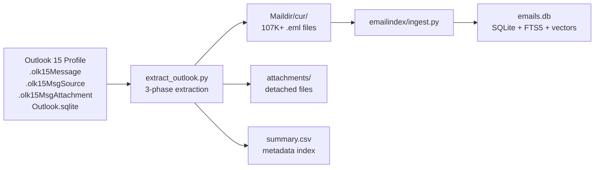
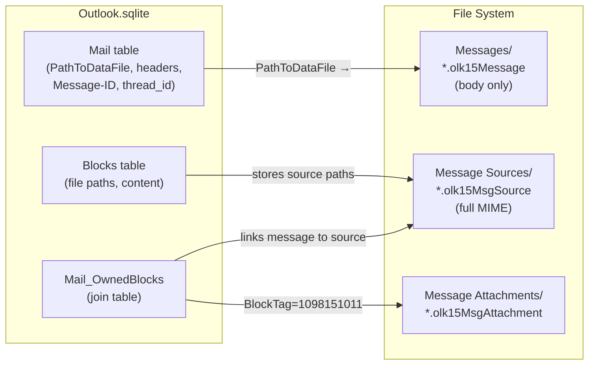
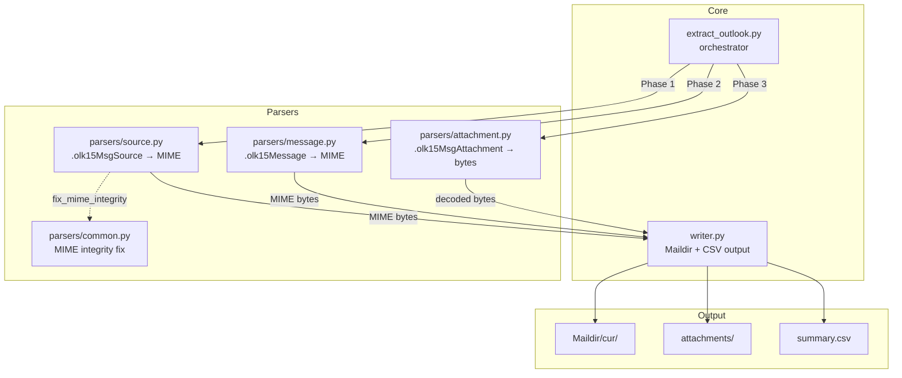
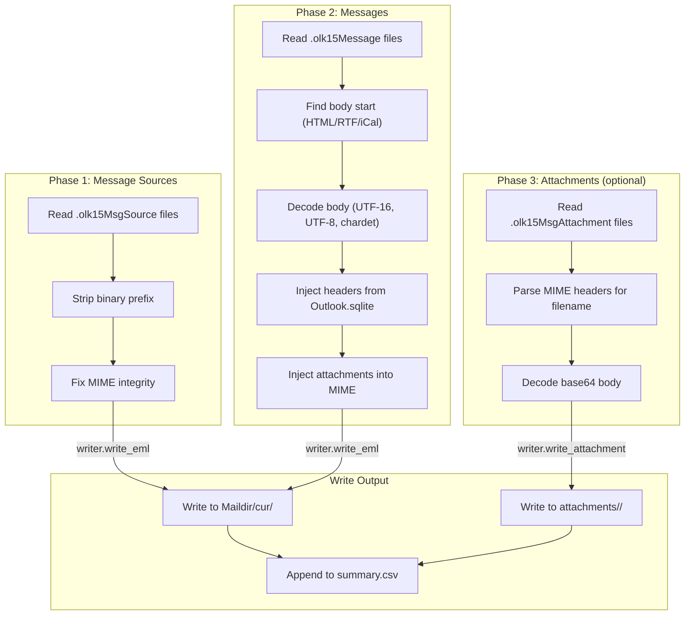
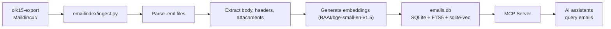

# olk15-export

Extract emails and attachments from macOS Outlook 15 profiles into standard Maildir format.

Outlook 15 for Mac stores emails in proprietary `.olk15Message`, `.olk15MsgSource`, and `.olk15MsgAttachment` files. This tool reconstructs them into RFC-compliant `.eml` files organized as a Maildir, ready for import into Thunderbird, Apple Mail, or ingestion by downstream tools.

## Features

- **SQLite metadata reconstruction** — Injects headers (From, To, Subject, Date, Message-ID) from `Outlook.sqlite` into emails that lack them in their binary payload
- **Smart body extraction** — Detects and decodes HTML, RTF, and iCalendar content from binary blobs, including UTF-16-encoded bodies
- **Native attachment injection** — Embeds detached attachments directly into `multipart/mixed` MIME structures during extraction
- **Message-ID deduplication** — Skips duplicate emails when both `.olk15MsgSource` and `.olk15Message` exist for the same message
- **Maildir output** — Writes directly to `Maildir/cur/` for compatibility with standard mail clients and tools
- **Resumable extraction** — `--max-messages` flag for testing with a subset of your archive

## How It Works



The output Maildir is consumed by [emailindex](https://github.com/thomasmaerz/emailindex), an email intelligence system that provides full-text search, semantic vector search, and conversation threading via MCP.

## Outlook 15 Source Data Structure

Outlook 15 for Mac splits each email across multiple proprietary files and a SQLite database. Understanding this structure is key to knowing why the extraction pipeline works the way it does.

### File Layout

```
Outlook 15 Profiles/Main Profile/Data/
├── Outlook.sqlite                          ← Metadata database (headers, threads, attachments)
├── Messages/                               ← Binary cache files (body only, no headers)
│   ├── <UUID-A>.olk15Message               ← HTML/RTF/iCal body blob
│   └── ...
├── Message Sources/                        ← Native MIME files (complete emails)
│   ├── <UUID-B>.olk15MsgSource             ← Full MIME with all headers
│   └── ...
└── Message Attachments/                    ← Detached attachment files
    └── <UUID-C>.olk15MsgAttachment         ← MIME-encoded attachment
```

### How the Pieces Relate



### Key Differences Between File Types

| | `.olk15MsgSource` | `.olk15Message` |
|---|---|---|
| **Location** | `Data/Message Sources/` | `Data/Messages/` |
| **Content** | Complete native MIME with all headers, body, and structure intact | Binary cache — body blob (HTML/RTF/iCal) only, no headers |
| **MIME parts** | `text/plain` + `text/html` + `text/calendar` (all present) | Reconstructed from binary — only the body format found |
| **Headers** | Embedded in the MIME itself | Reconstructed from `Outlook.sqlite` metadata |
| **Parsing** | Strip binary prefix, find MIME markers, fix line endings | Find body start, decode (UTF-16/UTF-8/chardet), rebuild MIME |
| **Reliability** | High — this is the actual email as received/sent | Lower — requires piecing together from DB |
| **Sample % coverage** | 7% — only emails with source blocks | 100% — all cached emails |

### Why Both Exist

Outlook 15 uses a two-tier caching strategy:

1. **`.olk15MsgSource`** — The actual email bytes as received from the server. Stored for messages that Outlook has fully downloaded. Only ~7% of messages have a source file.

2. **`.olk15Message`** — A binary cache of the body content, used for quick rendering in the message list. Every viewed email gets one, regardless of whether the full source was downloaded.

The `Mail_OwnedBlocks` join table in `Outlook.sqlite` links messages to their source files using completely different UUIDs — there's no filename-based pairing.

### Deduplication Strategy

Since ~5,400 emails exist in both formats with different UUIDs, the extraction pipeline processes `.olk15MsgSource` files first (complete MIME wins), then skips any `.olk15Message` files that share the same `Message-ID` header. This ensures the highest-fidelity version is always kept.

Message-IDs are normalized before comparison: angle brackets (`<>`) and surrounding whitespace are stripped so that `<BYAPR15MB1234@outlook.com>` and `BYAPR15MB1234@outlook.com` are correctly identified as duplicates.

## Architecture



## Extraction Pipeline



### Phase details

| Phase | Source | What it does | Priority |
|-------|--------|-------------|----------|
| **1** | `Data/Message Sources/*.olk15MsgSource` | Full MIME emails with headers intact — extracted first so duplicates are skipped in Phase 2 | High |
| **2** | `Data/Messages/*.olk15Message` | Binary cache files — headers reconstructed from `Outlook.sqlite`, body extracted from binary | High |
| **3** | `Data/Message Attachments/*.olk15MsgAttachment` | Standalone attachment files (only if `--include-attachments` is set) | Optional |

## Quick Start

### Prerequisites

- **Python 3.10+**
- **macOS** with an Outlook 15 profile
- **Dependencies**: `pip install chardet`

### Basic Usage

```bash
# Extract with default settings (outputs to ./output)
python3 extract_outlook.py

# Specify output directory
python3 extract_outlook.py --output ./my-export

# Include detached attachments
python3 extract_outlook.py --attachments-to-disk

# Flatten and deduplicate extracted attachments
python3 extract_outlook.py --attachments-to-disk --flatten-attachments

# Test with a small subset first
python3 extract_outlook.py --max-messages 100 --verbose

# Custom profile path
python3 extract_outlook.py --profile "/path/to/Outlook 15 Profiles/Main Profile" --output ./output
```

### CLI Reference

| Flag | Default | Description |
|------|---------|-------------|
| `--output`, `-o` | `./output` | Output directory for Maildir and attachments |
| `--profile` | `~/Library/Group Containers/UBF8T346G9.Office/Outlook/Outlook 15 Profiles/Main Profile` | Path to the Outlook 15 profile directory |
| `--attachments-to-disk` | Off | Extract attachment files to disk |
| `--include-attachments` | Off | **Deprecated** — alias for `--attachments-to-disk` |
| `--flatten-attachments` | Off | Flatten and deduplicate extracted attachments into `attachments/flat/` |
| `--max-messages`, `-n` | 0 (unlimited) | Stop after processing N messages (useful for testing) |
| `--verbose`, `-v` | Off | Enable debug logging |

## Output Structure

After extraction, the output directory looks like this:

```
output/
├── Maildir/
│   └── cur/                          # All extracted emails (Maildir format)
│       ├── 1775174416.639871.2c3cff47P49321MThomass-MacBook-Pro.local:2,
│       ├── 1775174416.643668.78caa172P49321MThomass-MacBook-Pro.local:2,
│       └── ...
├── attachments/
│   └── <uuid>/                       # Detached attachments per message (when --attachments-to-disk is used)
│       └── <filename>
│   └── flat/                         # Flattened, deduplicated attachments (when --flatten-attachments is used)
│       └── <filename>
├── summary.csv                       # Index of all extracted emails
└── extract.log                       # Extraction log (skips, errors)
```

### summary.csv

| Column | Description |
|--------|-------------|
| `uuid` | Outlook file UUID (stem of `.olk15*` filename) |
| `source` | Which source type produced this email (`sources` or `messages`) |
| `message_id` | RFC 2822 Message-ID header |
| `from` | Sender address |
| `to` | Recipient addresses |
| `subject` | Email subject |
| `date` | Date header |
| `source_file` | Which parser handled this email |

## Post-Processing Tools

### inject_attachments.py

Embeds detached attachments back into existing `.eml` files by reading the Outlook profile's attachment mapping.

```bash
python3 inject_attachments.py \
  --profile "/path/to/Outlook 15 Profiles/Main Profile" \
  --target ./output/Maildir/cur \
  --attachments ./output/attachments
```

### flatten_attachments.py

Deduplicates (via MD5 hash) and flattens nested attachment directories into a single folder, resolving filename collisions automatically.

```bash
python3 flatten_attachments.py \
  --source ./output/attachments \
  --dest ./attachments_flat
```

### test_harness.py

Runs the extraction pipeline on a limited set of files for testing and validation.

```bash
python3 test_harness.py --profile "/path/to/Outlook 15 Profiles/Main Profile" --output ./test-output
```

## Integration with emailindex

The Maildir output from this tool is the primary input for the [emailindex](https://github.com/thomasmaerz/emailindex) email intelligence system:



To ingest your exported emails:

```bash
cd ~/emailindex
python3 ingest.py ~/olk15-export/output/Maildir
```

## Known Limitations

- **Experimental** — This tool was built for a specific macOS Outlook 15 profile. Edge cases may exist with unusual message formats.
- **Outlook.sqlite dependency** — Phase 2 (`.olk15Message` extraction) requires the `Outlook.sqlite` database to reconstruct headers. If the database is missing or corrupted, those emails will have minimal headers.
- **No re-extraction** — The tool does not modify the Outlook profile. It reads files in read-only mode.

## License

MIT License
